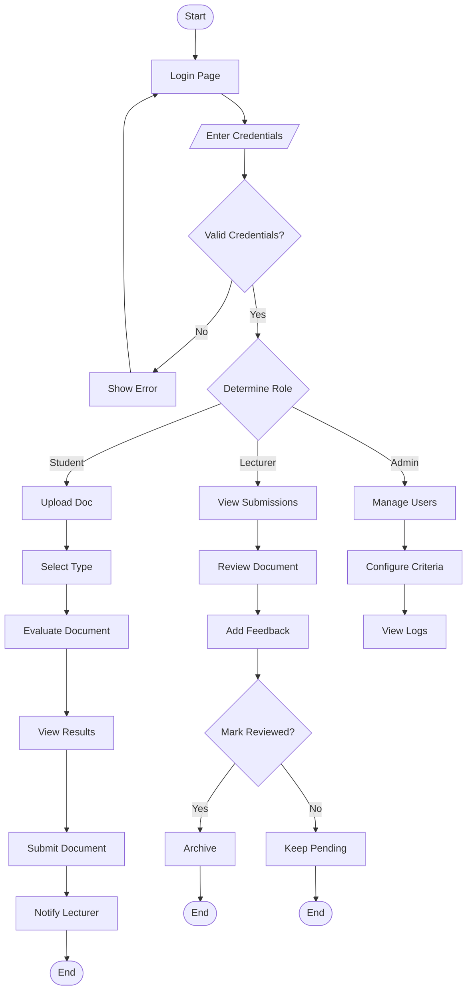
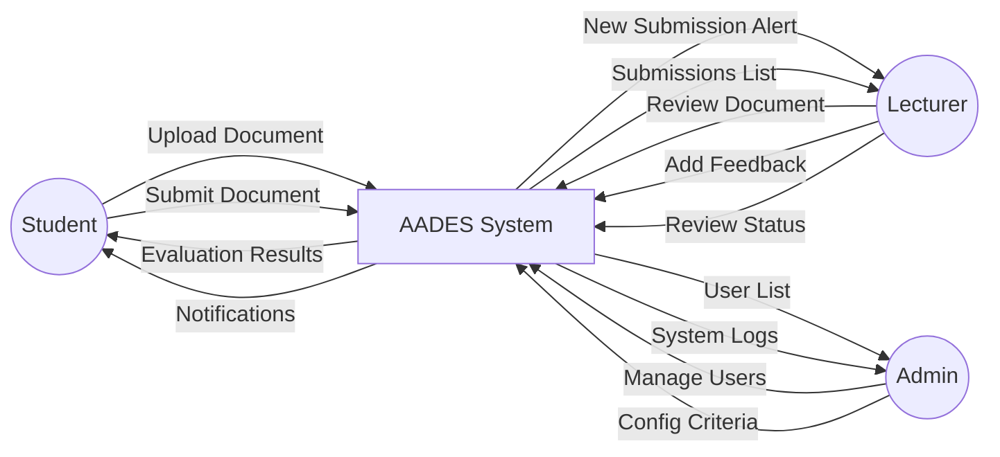
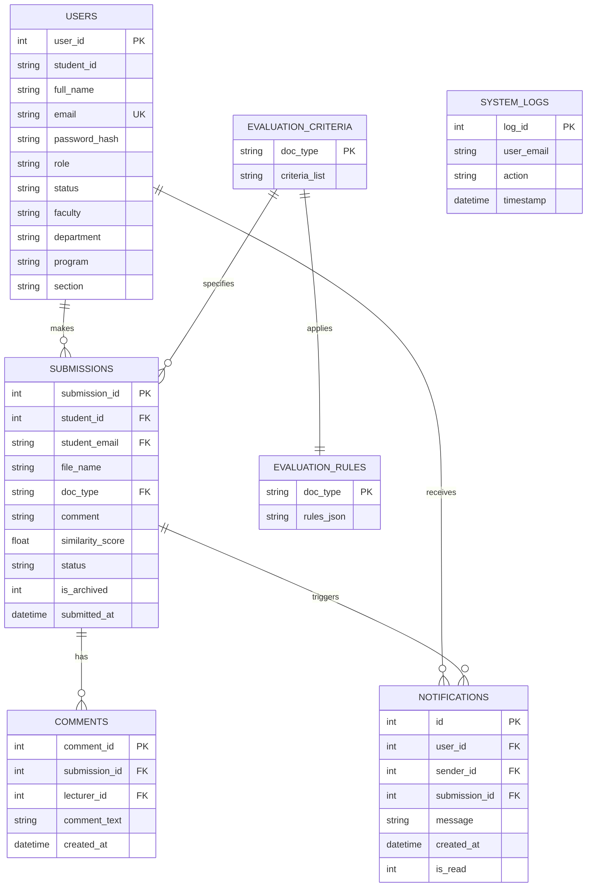
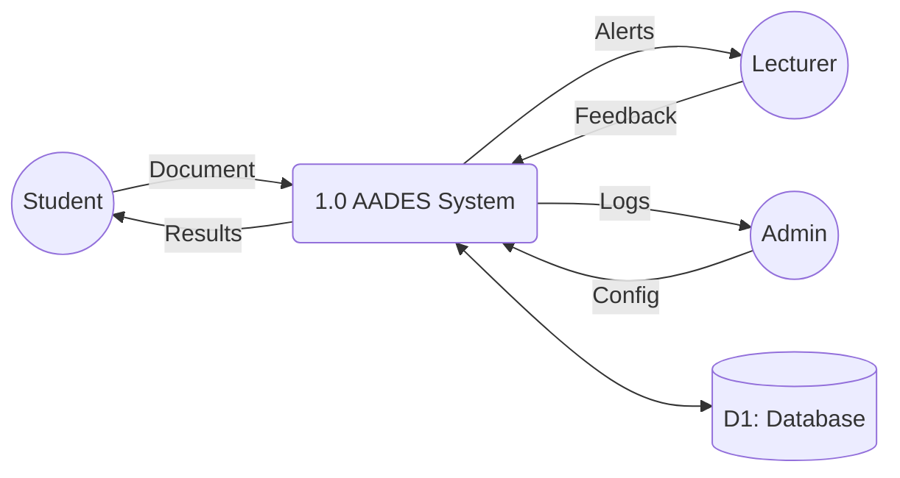
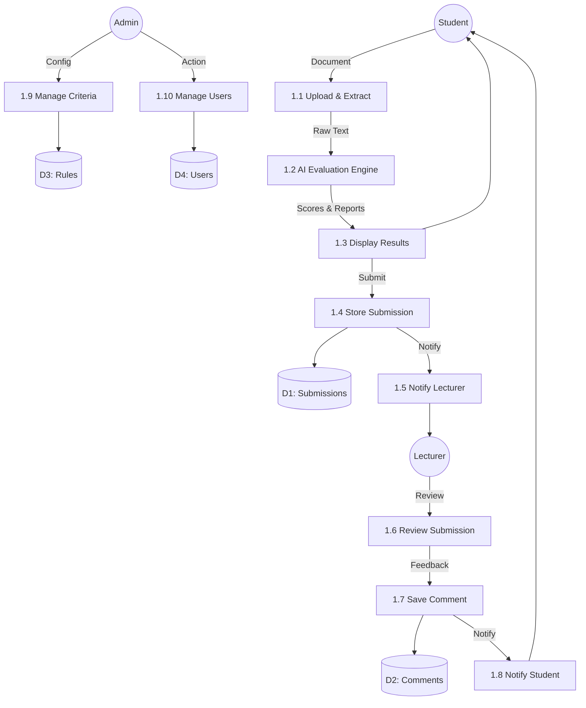
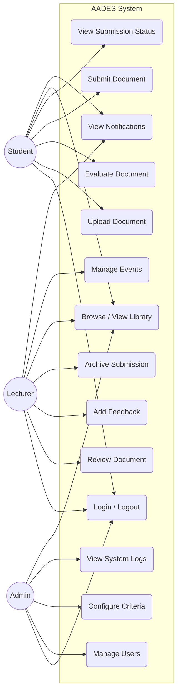

CANDIDATES' DECLARATION

We hereby declare that this project report, titled "Automated Academic Documentation Evaluation System (AADES)", is the result of our own original work carried out at the University of Professional Studies, Accra (UPSA). This work has not been presented for the award of any degree, diploma, or certificate at any other institution. All sources of information used have been duly acknowledged by means of references.


Candidates' Names & Signatures:

1. ..............................     Signature: ..............................     Date: ..............................

2. ..............................     Signature: ..............................     Date: ..............................

3. ..............................     Signature: ..............................     Date: ..............................

4. ..............................     Signature: ..............................     Date: ..............................


---


SUPERVISOR'S DECLARATION

I hereby certify that this project work was carried out by the candidates listed above under my supervision and meets the requirements for the award of their degree.


Supervisor Name: Mr Godwin Ntow Danso

Department: Information Technology Studies

Faculty: Faculty of Information Technology & Communication Studies


Signature: ..............................

Date: ..............................


---


DEDICATION

This project is dedicated to our families, friends, and the University of Professional Studies, Accra (UPSA), for their unwavering support, encouragement, and guidance throughout our academic journey.


---


ACKNOWLEDGEMENTS

We would like to express our profound gratitude to our project supervisor, Mr Godwin Ntow Danso, for his invaluable guidance, constructive feedback, and patience throughout the development of this project.

We also extend our sincere appreciation to the lecturers and staff of the Department of Information Technology Studies, UPSA, for equipping us with the theoretical and practical knowledge that made this project possible.

Special thanks go to our colleagues and peers who contributed feedback during the testing and usability evaluation phases of the system. Finally, we acknowledge the divine grace and the support of our families that sustained us throughout this academic endeavour.


---


ABSTRACT

The Automated Academic Documentation Evaluation System (AADES) is a web-based platform developed to address the challenge of maintaining academic documentation quality at the University of Professional Studies, Accra (UPSA). The system provides an AI-powered evaluation engine that automatically assesses student-submitted academic documents for structural compliance, grammatical accuracy, formatting adherence, and textual similarity. AADES supports three user roles — Students, Supervisors, and Administrators — each with dedicated dashboards and capabilities. Students upload documents in PDF or DOCX format, receive instant AI-generated feedback, and route their final submissions specifically to supervisors within their own academic department. Supervisors are provided with an isolated, secure review dashboard featuring targeted notifications, submission tracking, inline feedback, explicit review status management (Pending/Reviewed), and an archiving system. Administrators manage user accounts (including dynamic profile editing), evaluation criteria, and system audit logs. The system was developed using the Python Flask web framework with SQLite as the database backend, and the AI engine was built using rule-based natural language processing, regex pattern matching, and TF-IDF cosine similarity for plagiarism detection. Testing was conducted through unit, functional, usability, and acceptance testing approaches, confirming the system's effectiveness in automating the document evaluation process.

Keywords: Academic documentation, AI evaluation, plagiarism detection, grammar checking, Flask, UPSA


---


List of Tables

Table 3.1:    Hardware Requirements
Table 3.2:    Software Requirements


---


List of Figures

Figure 2.1:   Turnitin Plagiarism Detection Interface
Figure 2.2:   Grammarly Writing Assistant Interface
Figure 3.1:   System Flowchart
Figure 3.2:   Context Diagram
Figure 3.3:   ER Diagram
Figure 3.4:   Dataflow Diagram
Figure 3.5:   Use Case Diagram


---


CHAPTER 1

1.1 Introduction

This chapter introduces the Automated Academic Documentation Evaluation System (AADES), a web-based platform developed for the University of Professional Studies, Accra (UPSA). It presents the background to the study, the problem motivating the project, the objectives, scope, methodology, significance, and limitations of the system.


1.2 Background

Academic institutions globally face the challenge of ensuring that student-submitted documents meet prescribed standards of quality, structure, and originality. At the University of Professional Studies, Accra (UPSA), students are required to produce various types of academic documents including essays, research papers, theses, project reports, and proposals. Each document type carries specific structural requirements, formatting guidelines, and referencing standards.

Currently, the evaluation of these documents is an entirely manual process carried out by lecturers. This approach is time-consuming, subjective, and inconsistent. A single lecturer may be responsible for reviewing dozens of documents per semester, each requiring thorough examination for structural completeness, grammatical accuracy, APA referencing compliance, and plagiarism. This creates an unsustainable workload that delays feedback to students and may result in superficial reviews.

Furthermore, students lack access to an intermediary tool that allows them to self-evaluate their work before submission. They often submit documents with missing sections, incorrect formatting, grammatical errors, and inadvertent similarities to existing work — issues that could be caught early with automated assistance.

The emergence of artificial intelligence (AI) and natural language processing (NLP) technologies presents a viable solution. AI-powered document evaluation systems can automatically assess documents against predefined criteria, provide instant feedback, flag potential plagiarism, and generate quality scores — all within seconds. The Automated Academic Documentation Evaluation System (AADES) was conceived to address this gap at UPSA.


1.3 Statement of the Problem

The manual evaluation of academic documents at UPSA suffers from several critical limitations. Different lecturers may apply different standards when evaluating the same document type, leading to inconsistent feedback. Lecturers face significant time pressure when reviewing large volumes of submissions, particularly during peak periods. The manual review cycle often means students receive feedback weeks after submission, reducing the opportunity for iterative improvement. Without an integrated plagiarism detection tool, lecturers must rely on their own familiarity with existing literature to identify potential academic dishonesty. Students have no mechanism to pre-evaluate their documents before submission, resulting in avoidable errors persisting into the final version. There is also no centralized system for defining, updating, or enforcing evaluation criteria across different document types.

These challenges collectively undermine the quality of academic documentation at the institution and place an unsustainable burden on teaching staff.


1.4 Study Objectives

1.4.1 General Objective

To design and develop an automated, AI-powered web-based system that evaluates academic documents for structural compliance, grammatical accuracy, formatting adherence, and textual similarity at the University of Professional Studies, Accra.

1.4.2 Specific Objectives

i. To develop a web application that allows students to upload and evaluate academic documents (PDF, DOCX) against predefined criteria.

ii. To implement an AI evaluation engine capable of detecting missing sections, grammatical errors, APA referencing violations, and in-text citation issues.

iii. To integrate a TF-IDF cosine similarity-based plagiarism detection module that compares new submissions against existing documents.

iv. To create a multi-role user system supporting Students, Lecturers, and Administrators with role-specific dashboards.

v. To enable lecturers to review submissions, provide feedback, explicitly mark reviews as complete, and archive completed reviews.

vi. To implement a real-time notification system that alerts lecturers of new submissions and students of lecturer feedback.

vii. To develop an administrative interface for managing users, evaluation criteria, and system audit logs.

viii. To design and implement a document library where lecturer-approved documents can be promoted as reference materials.


1.5 Scope of the Project

The scope of this project includes the development of a multi-role web application supporting Students, Supervisors, and Administrators. The system accepts PDF and DOCX file uploads and evaluates them against configurable criteria for six document types: Essay, Research Paper, Scientific Paper, Thesis, Project Report, and Proposal. The AI engine performs structural analysis with fuzzy alias matching, grammar checking, APA reference validation, in-text citation detection, formatting compliance checks (font size, font family, page count, word count), table and figure detection, and TF-IDF cosine similarity-based plagiarism detection. The supervisor review workflow enforces department-level privacy boundaries and includes submission tracking, targeted notifications, inline feedback, and explicit status management (Pending, Reviewed, Archived). The admin module provides advanced user management (creation, live editing, status toggling, deletion), dynamic evaluation criteria configuration, and system audit logs. A document library allows supervisors to promote high-quality submissions as reference materials.

The project does not include integration with external plagiarism databases such as Turnitin, real-time collaborative document editing, machine learning model training, mobile application development, or support for file formats other than PDF, DOC, and DOCX.


1.6. Methodology for Project

The project was developed using the Agile Software Development Methodology, specifically an iterative and incremental approach. This methodology was chosen for its flexibility in accommodating changing requirements and its emphasis on delivering working software in short development cycles known as sprints.

The development process followed these phases: requirements gathering through analysis of existing evaluation workflows at UPSA; system design including database schema, architecture, and UI prototyping; iterative development with each sprint delivering a functional module; testing after each sprint to ensure correctness; and deployment on a local development server for demonstration.

The technology stack used includes Python 3.x as the core language, the Flask web framework for the backend, SQLite 3 for the database, HTML5/CSS3/JavaScript with Bootstrap 5 for the frontend, PyPDF2 and python-docx for document parsing, and Werkzeug for password hashing (PBKDF2-SHA256).


1.7 Significance of the Project

This project holds significant value for the UPSA academic community. For students, it provides immediate, objective feedback on document quality before final submission, enabling self-assessment and iterative improvement. For lecturers, it reduces the manual burden of document evaluation by automating structural, grammatical, and similarity checks, while the review workflow provides a trackable process. For the institution, it establishes a standardized evaluation framework that ensures consistency across departments and document types. The integrated plagiarism detection module promotes academic integrity by flagging similar submissions. The document library preserves lecturer-approved documents as reference materials, creating a growing institutional knowledge base.


1.8 Limitations of the Project

The evaluation engine uses rule-based pattern matching rather than machine learning models, which limits its ability to understand semantic context or detect paraphrased plagiarism. The similarity checker compares documents only against previously uploaded files within the AADES system, not against external databases or the internet. The system has limited support for legacy .doc files; full functionality requires .docx or .pdf formats. The SQLite database is file-based and not designed for high-concurrency production environments. The built-in grammar checker targets common academic writing errors but does not match the comprehensiveness of commercial tools. As a web-based system, AADES requires an active network connection for access.


1.9 Organization of the Report

This report is organized into five chapters. Chapter 1 presents the introduction, background, problem statement, objectives, scope, methodology, significance, and limitations of the project. Chapter 2 reviews existing systems and technologies related to academic document evaluation and positions the proposed system. Chapter 3 details the system development methodology, requirements analysis, and system design with diagrams. Chapter 4 describes the implementation process, testing approaches, system documentation, and challenges encountered. Chapter 5 summarizes the project, presents conclusions, and proposes recommendations for future development.


1.10 Chapter Summary

This chapter has provided a comprehensive introduction to the Automated Academic Documentation Evaluation System (AADES). The problem of manual academic document evaluation at UPSA was established, along with the objectives, scope, and significance of the proposed solution. The Agile development methodology and technology stack were outlined, and the limitations of the current implementation were acknowledged.


---


CHAPTER 2

LITERATURE REVIEW

2.1 Introduction

This chapter reviews existing literature and technologies related to automated academic document evaluation. It examines current systems that address plagiarism detection, grammar checking, structural analysis, and academic workflow management. The chapter identifies gaps in existing solutions and positions the proposed AADES system as a comprehensive alternative tailored to UPSA's specific requirements.


2.2 General background of the study area

Academic documentation quality assurance has been a growing area of concern in higher education institutions worldwide. The increasing volume of student submissions, coupled with pressure on academic staff to maintain rigorous evaluation standards, has driven the adoption of technology-assisted evaluation tools.

Plagiarism detection is one of the most critical concerns in academic integrity. According to Maurer, Kappe, and Zaka (2006), plagiarism detection systems can be classified into external detection (comparing submissions against a large corpus of published works) and internal detection (comparing submissions against each other within an institution). Tools such as Turnitin and iThenticate represent external detection systems, while institution-level systems focus on internal comparisons.

Automated grammar checking has evolved from basic spell-checkers to context-aware tools like Grammarly, ProWritingAid, and LanguageTool. These tools use combinations of rule-based processing and machine learning to identify grammatical errors, stylistic issues, and readability problems (Ghufron & Rosyida, 2018).

The structural evaluation of academic documents — ensuring the presence of required sections such as abstracts, introductions, literature reviews, and references — remains a largely manual process. Most institutions rely entirely on manual review for structural compliance. However, natural language processing techniques, particularly section heading detection and document parsing, offer potential for automation (Tkaczyk et al., 2015).

Formatting compliance — including font size, font family, margins, and page limits — is another area where no widespread automated post-submission verification tool exists in the academic context (Batista & Silva, 2020).


2.3 Review of Existing Systems and Technologies

Turnitin is the most widely used plagiarism detection service in higher education. It compares submitted documents against a massive database of academic papers, web pages, and previously submitted student work, generating an originality report with the percentage of matching text. While Turnitin is comprehensive in plagiarism detection, it does not evaluate document structure, grammar, or formatting. It is also a subscription-based commercial product, making it costly for some institutions.

Grammarly is a commercial writing assistant that provides real-time grammar, spelling, punctuation, and style checking using a combination of rule-based algorithms and machine learning. While highly accurate for grammar detection, Grammarly does not evaluate document structure, offers limited plagiarism detection in the free tier, and is not designed for institutional academic evaluation workflows.

LanguageTool is an open-source grammar, style, and spell-checking tool available in multiple languages. It can be embedded into applications via its Java-based server or Python client library. While it is free and extensible, it does not provide document structure analysis or plagiarism detection and is not an end-to-end academic evaluation platform.

Google Classroom and Microsoft Teams for Education provide submission management and basic feedback capabilities. Students can submit documents and instructors can comment and grade within the platform. However, these systems offer no automated evaluation of document quality, no plagiarism detection, and no structural or grammatical analysis.

No single existing solution addresses all dimensions of academic document evaluation — structure, grammar, plagiarism, formatting, and review workflow — in an integrated, institution-specific platform.


2.4 Proposed System

The Automated Academic Documentation Evaluation System (AADES) addresses the gaps identified in the existing systems by providing an all-in-one, AI-powered platform tailored for UPSA. The system integrates a rule-based AI evaluation engine that assesses documents across ten quality dimensions: section presence with fuzzy alias matching, sub-heading compliance, APA reference format, in-text citations, word count per section, page limits, line counts, table and figure presence, font compliance, and total word count. It includes a TF-IDF cosine similarity module for internal plagiarism detection, a grammar checking engine with regex pattern-matching rules, and a multi-role web interface with dedicated dashboards for Students, Lecturers, and Administrators. The system provides a complete review lifecycle enabling lecturers to track submissions from arrival through feedback, explicit review confirmation, and archiving, along with a real-time bidirectional notification system.


2.5 Chapter Summary

This chapter reviewed existing systems and technologies related to academic document evaluation, including Turnitin, Grammarly, LanguageTool, and educational management platforms. The review revealed that no existing solution provides a comprehensive, integrated evaluation covering structure, grammar, plagiarism, formatting, and review workflow management. The proposed AADES system was positioned as a purpose-built solution that fills these gaps for the UPSA academic community.


---


CHAPTER 3

METHODOLOGY

3.1 Introduction

This chapter describes the methodology adopted for developing the Automated Academic Documentation Evaluation System. It covers the system development methodology, the crystallization of the problem, the requirements of the proposed system, and the system design illustrated through diagrams.


3.2 System Development Methodology

The Agile Software Development Methodology was adopted for this project. Agile emphasizes iterative development, collaboration, and responsiveness to change. The project followed a series of development sprints, each delivering a working increment of the system:

Sprint 1: Project setup, database schema design, user authentication (login/logout), and role-based routing.
Sprint 2: Document upload, text extraction for PDF and DOCX, and basic structural evaluation.
Sprint 3: Advanced AI evaluation engine — grammar checking, APA validation, citation detection, formatting checks, and similarity scoring.
Sprint 4: Lecturer dashboard, submission review workflow, feedback system, and document viewer.
Sprint 5: Admin dashboard, user management, evaluation criteria configuration, system logs, and document library.
Sprint 6: Notification system, review status tracking (Pending/Reviewed/Archived), and UI polish.

The Agile approach was suitable because requirements evolved during development, each sprint produced a testable increment, and supervisor feedback was incorporated iteratively.


3.3 Crystallization of the Problem

Through analysis of the current academic documentation workflow at UPSA, the following problems were identified and translated into technical requirements:

The absence of automated structural evaluation was addressed by developing an AI engine with fuzzy matching for section detection. The lack of grammar feedback before submission was addressed by building a rule-based grammar checker with highlighted errors. The absence of plagiarism detection within the institution was addressed by creating a TF-IDF cosine similarity module. The lack of formatting checks was addressed by implementing font, page, and word count validation against configurable rules. Inconsistency across lecturers was addressed by centralizing evaluation criteria under admin control. Delayed feedback to students was addressed through instant AI-generated results. The absence of submission tracking was addressed by implementing a database-backed status and review system. The lack of a communication channel was addressed by building a bidirectional notification system.


3.4 Requirements of the Proposed System

3.4.1 Functional Requirement

The system shall provide secure user authentication with hashed passwords (PBKDF2-SHA256). It shall support three user roles (Student, Supervisor, Admin) with distinct permissions and dashboards. It shall accept PDF and DOCX file uploads with file type validation. Students shall be able to select a document type before evaluation. The AI engine shall detect the presence of required sections using fuzzy alias matching, identify grammar errors and suggest corrections, validate references against APA format patterns, detect in-text citation patterns, compute plagiarism similarity scores, check font size and family compliance, verify page count and word count limits, and detect the presence of tables and figures. Students shall submit evaluated documents by explicitly routing them to a designated supervisor within their own academic department. Supervisors shall be restricted to viewing and managing only submissions assigned to them, ensuring departmental privacy. Supervisors shall be able to add feedback comments, explicitly mark submissions as reviewed, and archive completed reviews. The system shall send targeted notifications specifically to the assigned supervisor when a student submits a document, and back to the student when feedback is provided. Administrators shall be able to add, edit, suspend, activate, and delete user accounts via a dedicated graphical workflow, configure evaluation rules per document type, and view system audit logs. Supervisors shall be able to promote documents to a reference library.

3.4.2 Non-Functional Requirement

The system shall evaluate documents within 10 seconds. Passwords shall be hashed using PBKDF2-SHA256 with session-based authentication. The user interface shall be responsive and modern using Bootstrap 5, working across desktop and mobile browsers. The system shall handle file parsing errors gracefully without crashing. The architecture shall be modular with database-driven criteria rather than hardcoded values. The AI engine shall be separated into distinct modules for maintainability.

3.4.3 Software Requirements

Table 3.1: Hardware Requirements

| Component | Minimum Specification |
|-----------|----------------------|
| Processor | Intel Core i3 or equivalent |
| RAM | 4 GB |
| Storage | 500 MB available disk space |
| Display | 1280 × 720 resolution |
| Network | Internet or LAN connection |

Table 3.2: Software Requirements

| Software | Version | Purpose |
|----------|---------|---------|
| Python | 3.x | Core programming language |
| Flask | 2.x+ | Web application framework |
| SQLite | 3.x | Relational database engine |
| PyPDF2 | 3.x | PDF text extraction |
| python-docx | 0.8+ | DOCX text and metadata extraction |
| Bootstrap | 5.3 | Frontend UI framework |
| Bootstrap Icons | 1.11 | Icon library |
| Werkzeug | 2.x+ | Password hashing and HTTP utilities |
| HTML5 / CSS3 / JavaScript | — | Frontend markup, styling, interactivity |


3.5 Design of the System

3.5.1 Flowchart Diagram

The system flowchart illustrates the complete user journey from login through document evaluation, submission, review, and archiving.



3.5.2 Context Diagram

The context diagram shows AADES as a central process with three external entities.



3.5.3 Entity Relationship Diagram (ERD)

The database consists of seven tables.



Relationships:
- USERS (1) → (Many) SUBMISSIONS: A user can have many submissions.
- USERS (1) → (Many) NOTIFICATIONS: A user can receive many notifications.
- SUBMISSIONS (1) → (Many) COMMENTS: A submission can have many comments.
- SUBMISSIONS (1) → (Many) NOTIFICATIONS: A submission can trigger many notifications.
- EVALUATION_CRITERIA (1) → (1) EVALUATION_RULES: Each rule set is linked to criteria.
- EVALUATION_CRITERIA (1) → (Many) SUBMISSIONS: Each document type maps to multiple submissions.

3.5.4 Data Flow Diagram (DFD)

Level 0 DFD:



Level 1 DFD:



3.5.5 Use Case Diagram




3. 6  Chapter Summary

This chapter detailed the Agile methodology adopted for development, crystallized the identified problems into technical requirements, and specified the functional and non-functional requirements of the system. The hardware and software requirements were documented, and the system design was illustrated through a flowchart, context diagram, entity relationship diagram, data flow diagrams, and a use case diagram.


---


CHAPTER 4

IMPLEMENTATION AND DOCUMENTATION OF THE PROPOSED SYSTEM

4.1 Introduction

This chapter describes the implementation of the Automated Academic Documentation Evaluation System (AADES). It discusses the testing approaches considered, the implementation strategy selected, provides system documentation with a walkthrough of the key modules and interfaces, and documents the challenges encountered during development.


4.2 Testing Approaches

4.2.1 Unit Testing

Unit testing involves testing individual components or functions in isolation. For AADES, unit tests were applied to the AI engine modules. The structure_checker module was tested to verify correct detection of required sections, identification of missing sections, validation of APA references, and application of fuzzy alias matching. The grammar_checker module was tested to verify correct identification of grammar patterns such as "their is" being flagged with a suggestion of "there is", and "alot" being flagged with a suggestion of "a lot". The similarity_checker module was tested to verify that identical texts produce a 100% score, completely different texts produce 0%, and partially similar texts produce intermediate scores. The text extraction function was tested to verify correct extraction from both PDF and DOCX files, including table content from DOCX documents.

4.2.2 Functional Testing

Functional testing validates end-to-end system features. Test cases included: logging in with valid credentials and verifying redirection to the correct dashboard; logging in with invalid credentials and verifying the error message; uploading a PDF document and evaluating it to verify structural, grammar, and similarity scores appear correctly; uploading a DOCX with tables and verifying table detection; submitting a document and verifying it appears on the lecturer dashboard with a notification sent; adding lecturer feedback and verifying the comment is saved and the student is notified; marking a submission as reviewed and verifying the status changes on the student dashboard; archiving a submission and verifying it moves to the archive view; adding a new student user via admin and verifying student-specific fields are visible; adding a new lecturer user and verifying student fields are hidden; and suspending a user and verifying they cannot log in. All test cases passed successfully.

4.2.3 Usability Testing

Usability testing was conducted with a small group of students and lecturers. Users found the AI evaluation scanning modal intuitive and professional. The colour-coded status badges (Pending in orange, Reviewed in green) were immediately understood. The notification bell with unread count was described as familiar and expected. The admin criteria configuration interface was considered comprehensive.

4.2.4 Acceptance Testing

Acceptance testing was performed with the project supervisor to validate that the system meets the stated objectives. The supervisor confirmed that all six document types evaluate correctly, the lecturer review workflow operates as expected, the notification system provides timely alerts, and the admin interface provides comprehensive management capabilities.

4.2.5 Selected Testing Approach

The primary testing approach used was functional testing, supplemented by unit tests for the AI engine modules and usability testing for interface validation. This combination was chosen because AADES is a feature-driven application where end-to-end verification is critical, the AI engine modules required isolated validation, and user experience is a core quality attribute.


4.3 Implementation of the Current System

4.3.1 Parallel implementation

Parallel implementation involves running both the old and new systems simultaneously. This approach was not applicable to AADES since there is no existing automated evaluation system at UPSA to run in parallel with.

4.3.2 Pilot implementation

Pilot implementation deploys the system to a limited group of users before full rollout. This approach was partially adopted — the system was tested with a selected group of 10 students and 1 lecturer before broader demonstration to validate the workflow in a realistic setting.

4.3.3 Direct implementation

Direct implementation involves immediately replacing the current process with the new system. This approach was not adopted due to the risk of disrupting the existing manual workflow without sufficient validation and user training.

4.3.4 Phased Implementation

Phased implementation rolls out the system module by module. This was the selected implementation approach for AADES. The system was deployed in phases aligned with the development sprints: Phase 1 covered user authentication and role-based dashboards; Phase 2 covered document upload and the AI evaluation engine; Phase 3 covered the lecturer review workflow and feedback system; Phase 4 covered the notification system and archiving; and Phase 5 covered admin management interfaces and the document library.


4.4 System Documentation

The AADES system is organized into the following directory structure:

```
AADES/
├── app.py                        # Main Flask application (1,500+ lines)
├── aades_db.sqlite               # SQLite database file
├── ai_engine/                    # AI evaluation engine modules
│   ├── __init__.py
│   ├── structure_checker.py      # Section, APA, citation, formatting checks (451 lines)
│   ├── grammar_checker.py        # Rule-based grammar and style checker (129 lines)
│   ├── similarity_checker.py     # TF-IDF cosine similarity detector (70 lines)
│   └── evaluator.py              # Module orchestrator
├── templates/                    # Jinja2 HTML templates (13 files)
│   ├── base.html                 # Base template with navbar and footer
│   ├── login.html                # Authentication page
│   ├── index.html                # Student upload and evaluation page
│   ├── dashboard.html            # Student dashboard
│   ├── lecturer_dashboard.html   # Lecturer review dashboard
│   ├── admin_dashboard.html      # Administrator management console
│   ├── admin_criteria.html       # Evaluation criteria editor
│   ├── admin_logs.html           # System audit log viewer
│   ├── notifications.html        # Notification inbox
│   ├── library.html              # Document library browser
│   ├── view_document.html        # Full document viewer with evaluation
│   ├── manage_events.html        # Lecturer event management
│   └── result.html               # Evaluation results display
├── static/
│   ├── css/main.css              # Custom stylesheet
│   └── images/                   # Static image assets
├── uploads/                      # Uploaded student documents
├── library/                      # Lecturer-promoted reference documents
└── venv/                         # Python virtual environment
```

The main application file (app.py) contains all route handlers, database initialization, text extraction utilities, and helper functions. The AI evaluation engine is separated into three specialized modules within the ai_engine directory. The structure_checker module performs section detection with fuzzy alias matching, sub-heading verification, APA reference validation, in-text citation detection, word count analysis, page and line limit checks, table and figure detection, and font compliance verification. The grammar_checker module uses a built-in rule-based engine with regex patterns to detect common academic writing errors including misspellings, grammatical mistakes, and stylistic redundancies. The similarity_checker module implements TF-IDF cosine similarity to compare a new document against all previously submitted documents and returns the highest similarity percentage.

The system uses session-based authentication with Flask sessions. Passwords are hashed using Werkzeug's PBKDF2-SHA256 implementation before storage. Role-based access control is enforced at each route through session checks. A context processor automatically injects the unread notification count into every template for display on the navigation bar bell icon.

The database contains seven tables: users for account information, submissions for document records, notifications for the alert system, comments for lecturer feedback, evaluation_criteria for legacy criteria storage, evaluation_rules for the advanced JSON-based rule engine, and system_logs for audit tracking.

The following subsections describe the key interfaces and functionalities of the AADES system, organized by user-facing page.


4.4.1 System Authentication / Login Page

The Login Page serves as the single entry point to the AADES platform. It is the first screen presented to any user who accesses the system and is responsible for authenticating all three user roles — Students, Supervisors, and Administrators — through a unified interface.

The page displays a centred authentication card with a welcoming heading ("Welcome back") and a brief instructional subtitle ("Enter your credentials to access your dashboard"). Below this, two form fields are presented: an Email Address field and a Password field. Both fields are required and include placeholder text to guide user input. A "Forgot password?" link is included for future password recovery functionality. The primary call-to-action is a "Sign In" button that submits the credentials to the server for validation.

When a user submits the login form, the system queries the users table in the SQLite database to locate a matching email address. If the user exists and their account status is "active", the entered password is verified against the stored hash using Werkzeug's PBKDF2-SHA256 check_password_hash function. Upon successful authentication, the user's complete profile (including user_id, full_name, email, role, student_id, faculty, department, program, and section) is stored in the Flask server-side session, and the user is redirected to the appropriate role-specific dashboard. If authentication fails — either due to an incorrect password or a non-existent email — a red error alert is displayed on the same page with the message "Invalid email or password." If the user's account has been suspended by an administrator (status is not "active"), the system displays the message "Your account is not active."

Every login attempt, whether successful or failed, is recorded in the system_logs table with a timestamp and descriptive action text (e.g., "Logged in successfully", "Failed login attempt (bad password)", or "Failed login attempt (user not found)"), providing a full audit trail accessible to administrators.

The login page uses a dedicated stylesheet (auth.css) separate from the main application theme, creating a clean, distraction-free authentication experience without the navigation bar or footer present on other pages.


4.4.2 Admin Dashboard Page

The Admin Dashboard is the central management console for system administrators. It is accessible only to users with the "admin" role and provides a comprehensive overview of the entire platform's users and submissions, along with tools for account management.

At the top of the page, a personalized welcome header greets the administrator by name and displays the subtitle "System-wide management of users, submissions, and platform health." Two quick-access buttons — Criteria and Logs — are placed alongside an "Administrator" badge, providing direct navigation to the Evaluation Criteria editor and the System Audit Logs viewer respectively.

Below the header, four summary statistics cards are displayed in a horizontal row, each showing a key platform metric in large, bold typography: Total Users (the combined count of students and supervisors), Students (the number of registered student accounts), Supervisors (the number of registered supervisor accounts), and Submissions (the total number of documents submitted across the platform). These cards give the administrator an at-a-glance overview of platform activity and scale.

The main body of the dashboard is divided into two sections. The left panel (occupying two-thirds of the width) contains the User Management table. This table lists every registered user in the system and displays their Full Name (with a role-specific icon — a mortarboard for students, a workspace icon for supervisors, and a shield for admins), their University/Staff ID, Email address, Role (shown as a colour-coded badge — blue for Student, yellow for Supervisor, dark for Admin), and Status (shown as either a green "Active" indicator with a checkmark or a red "Inactive" indicator with a cross icon). A search bar above the table allows the administrator to filter users in real time by typing a student ID, name, or email, with a feedback indicator showing how many results match the query.

For each non-admin user, three action buttons are provided: an Edit button (pencil icon) that opens an Edit User modal, a Suspend/Activate toggle button that changes the user's account status, and a Delete button (trash icon) that permanently removes the user after confirmation. The admin account itself is marked as "Protected" and cannot be edited, suspended, or deleted, ensuring the system always has at least one active administrator.

The Add User button at the top of the user table opens a "Provision New Account" modal. This modal features a gradient header and is organized into grouped sections: Core Credentials (Full Name and Email Address), Role and Identity (University ID and a System Role dropdown offering Student, Supervisor, or Admin), Academic Profile (Faculty/School, Department, Program of Study, and Academic Section — the latter two fields are dynamically shown or hidden based on the selected role using JavaScript), and Security (a Temporary Password field with a minimum length requirement of 6 characters). The "Register Account" button submits the form and creates the user with a hashed password.

The Edit User modal mirrors the structure of the Add User modal but pre-populates all fields with the selected user's current data. It allows the administrator to update the user's name, email, university ID, faculty, department, and — for student accounts — program and academic section.

The right panel (occupying one-third of the width) displays a Recent Submissions sidebar. This panel lists the ten most recent document submissions across the platform, showing the student's name, the uploaded file name, the document type (as an uppercase badge), and the submission timestamp. If no submissions exist, a placeholder message with an inbox icon is displayed.


4.4.3 Student Dashboard Page

The Student Dashboard is the primary landing page for authenticated student users. It provides an overview of the student's academic profile, quick access to core system features, a complete history of all their submissions, and a summary of their most recent evaluation results.

The header section displays a personalized greeting ("Hello, [Student Name]") accompanied by the student's academic details — their Program of Study and Department — if available. On the right side of the header, the student's University ID is shown inside a branded badge, and their Academic Section (Regular, Evening School, or Weekend School) is displayed in a secondary badge if assigned.

Three Quick Action cards are presented in a horizontal row, each featuring a distinctive icon, a title, a brief description, and a call-to-action button. The first card, "Ready to Evaluate?", directs the student to the document upload and evaluation page where they can check their document's structure and grammar before submitting. The second card, "Academic Library", links to the Document Library where students can access supervisor-approved reference documents from the faculty. The third card, "Stay Updated", links to the Notifications page where students can view recent feedback and comments from their supervisors.

Below the quick action cards, a full-width "My Submissions" table displays every document the student has submitted to the system. Each row in the table shows the Document name (the uploaded file name), the document Type (displayed as an uppercase badge, e.g., "PROJECT", "PROPOSAL"), the Similarity score (colour-coded — green with a shield-check icon if below 15%, or red with a warning icon if above 15%), the Date of submission, the review Status (shown as a rounded pill badge — an orange "Pending" badge with an hourglass icon if the supervisor has not yet reviewed the document, or a green "Reviewed" badge with a checkmark icon if the supervisor has completed their review), and the Feedback column (displaying the supervisor's comment text along with the reviewer's name, or a dash if no feedback has been provided yet). If the student has no submissions, a centred placeholder message with an inbox icon reads "No submissions yet. Start by evaluating a document."

At the bottom of the page, if the student has recently evaluated a document during the current session, a "Last Evaluation" card appears. This card summarizes the most recent AI evaluation results, showing the Structure Score and Similarity Score as badge-style indicators, the evaluated file name, and a link to view the full detailed results on the evaluation page.


4.4.4 Supervisor Dashboard Page

The Supervisor Dashboard is the review and submission management interface for lecturer users. It provides supervisors with a comprehensive view of all student submissions assigned to them, along with tools to review documents, provide feedback, manage review statuses, and archive completed work.

The header section welcomes the supervisor by name and, if available, displays their Department and Faculty affiliation. Two navigation buttons are positioned to the right: "View Archives" (which navigates to the archive view showing previously archived submissions) and "Manage Events" (which links to the event management page where supervisors can schedule academic deadlines). When viewing the archive, the "View Archives" button is replaced by a "Back to Dashboard" button, allowing seamless navigation between active and archived submissions.

Three statistics cards are displayed below the header (visible only on the main dashboard, not in archive view), each featuring a gradient-coloured circular icon: Total Submissions (showing the cumulative count of all submissions ever assigned to the supervisor, including archived ones), Pending Review (showing the number of submissions that have not yet been marked as reviewed, displayed in orange), and Reviewed (showing the number of submissions the supervisor has explicitly marked as reviewed, displayed in green).

The core of the dashboard is the Student Submissions table. A search bar above the table allows the supervisor to filter submissions by student name or email in real time, with a feedback indicator showing the number of matching results. The table has four columns: Student, Document Info, Comment/Feedback, and Actions.

The Student column displays the student's full name as a clickable link. Clicking the name opens a Student Profile modal that presents the student's complete academic identity — a profile avatar, full name, University ID, an "Email Student" button (which opens the default email client), and their academic assignment details including Faculty/School, Department, Program of Study, and Academic Section. The student's email address is also shown beneath their name in the main table.

The Document Info column shows the uploaded file name and two badges: the document type (e.g., "PROJECT", "ESSAY") and the similarity score. The similarity score is colour-coded — a green badge reading "X% Similarity" with a shield-check icon if the score is at or below 15%, or a red badge with a warning icon if it exceeds 15%, alerting the supervisor to potential plagiarism.

The Comment/Feedback column contains an inline form with a text input field and a "Save" button, allowing the supervisor to type and save feedback comments directly from the table without opening a separate page. If a previous comment exists, it is pre-populated in the input field for editing.

The Actions column provides several controls depending on the submission's current status. A "Review" button opens a full-screen Document Review modal. Within this modal, the supervisor has access to a tabbed interface with three options: "View Document" (which renders the PDF in an embedded iframe or shows a download prompt for DOCX files), "Syntax Errors" (which displays the document text with grammar errors highlighted in red — hovering over highlighted words reveals AI-generated correction suggestions in a tooltip), and "Web Plagiarism Scan" (which triggers a live internet plagiarism check and presents the results in a dedicated modal showing the overall match percentage and a list of identified source URLs with their match percentages). A "Download" button is also available to save the original file locally.

Above the document and error views, an analytics dashboard displays three AI-computed scores: AI Evaluation (a weighted composite of grammar and structure scores), Grammar Accuracy (the percentage of text free from grammar errors), and Structure Compliance (a score reflecting structural adherence to the selected document type). Each score includes a progress bar for visual representation.

If a submission's status is "Pending", a green "Mark Reviewed" button is displayed. Clicking it (with a confirmation prompt) explicitly changes the submission's status to "reviewed", which is then reflected on the student's dashboard. This action is decoupled from commenting — a supervisor can add feedback without marking the submission as reviewed, and vice versa. Once marked as reviewed, a green "Reviewed" badge replaces the button, and an "Archive" button appears, allowing the supervisor to move the completed submission to the archive view and declutter the main dashboard. A "Library" button allows the supervisor to promote a high-quality submission to the Document Library, making it available as a reference document for all students.

In the archive view, the "Archive" and "Mark Reviewed" buttons are replaced by an "Unarchive" button, which restores the submission to the main active dashboard.


4.5 Implementation Challenges

Several challenges were encountered during development. The python-docx library parses paragraphs separately from tables, which meant documents containing tables initially reported no tables found because the text extraction only iterated over paragraphs. This was resolved by explicitly iterating over doc.tables and injecting TABLE markers into the extracted text.

Students use inconsistent section headings such as "Background", "Background of Study", "Background of the Study", and even misspellings like "Backgroud". A rigid string-matching approach produced frequent false negatives. This was resolved by implementing an alias dictionary that maps canonical section names to a list of acceptable variations and misspellings.

When students evaluated a document, the browser cleared the file input on form reload, requiring them to re-upload before submission. This was resolved by storing the filename in the server-side session and rendering a visual widget showing the retained file name.

Notifications were initially marked as read the moment the student visited their dashboard, causing the badge count to reset before they actually read the notifications. This was corrected so notifications are only marked read when the user explicitly visits the notifications page.

Submitting a comment initially marked the submission as reviewed automatically, which did not reflect the lecturer's actual intent. Lecturers requested explicit control over the review status. This was resolved by decoupling the comment route from the status update and introducing a dedicated Mark as Reviewed button.

Adding new columns to the submissions table during development required backward-compatible migration logic using ALTER TABLE statements with exception handling for cases where the columns already existed.


4.6 Chapter Summary

This chapter documented the implementation of AADES, including the testing approaches used, the phased implementation strategy adopted, comprehensive system documentation covering the directory structure and key modules, and the challenges encountered and resolved during development.


---


CHAPTER 5

SUMMARY, CONCLUSIONS AND RECOMMENDATIONS

5.1 Introduction

This final chapter summarizes the work accomplished, draws conclusions from the development and testing outcomes, identifies remaining limitations, and proposes recommendations for future research and development.


5.2 Summary

The Automated Academic Documentation Evaluation System (AADES) was successfully designed, developed, and tested as a web application for the University of Professional Studies, Accra. The system addresses the challenge of manual academic document evaluation by providing an AI evaluation engine comprising three modules — a structure checker with fuzzy alias matching, a rule-based grammar checker, and a TF-IDF cosine similarity plagiarism detector — that evaluates documents across ten quality dimensions. A multi-role web platform provides dedicated interfaces for Students to upload, evaluate, submit, and track documents; for Lecturers to review, provide feedback, manage review status, and archive submissions; and for Administrators to manage users, configure evaluation criteria, and monitor system activity. A real-time bidirectional notification system keeps both students and lecturers informed. A configurable evaluation framework allows administrators to define custom rules for each document type. A document library enables lecturers to promote high-quality submissions as reference materials. The system was developed using the Agile methodology over six sprints, utilizing Python Flask, SQLite, Bootstrap 5, and custom AI modules.


5.3 Limitations of the Study

The AI evaluation engine is rule-based and cannot perform semantic analysis or detect paraphrased plagiarism. The similarity checker compares documents only within the AADES upload repository, not against external academic databases. The system uses SQLite, which is not suitable for high-concurrency production environments. The grammar checker covers common academic errors but is not as comprehensive as dedicated commercial tools. The system does not support real-time collaborative editing or version tracking. Legacy .doc file format support is limited.


5.4 Recommendations for Future Research

Future research could explore integrating machine learning models such as BERT or GPT-based embeddings to improve semantic understanding for plagiarism detection and section classification. Integration with external APIs such as Crossref or Google Scholar would enable comparison against published academic literature. Migration from SQLite to PostgreSQL or MySQL would support production deployment with concurrent users. Integrating the full LanguageTool server or a fine-tuned NLP model would provide more comprehensive grammatical analysis. Implementing WebSocket-based notifications would enable instant push-based alerts without page refreshes. Developing a companion mobile application would support on-the-go submission tracking. Implementing document versioning would allow students to track revisions across submissions. Creating advanced analytics dashboards showing submission trends and common violations would provide institutional insights. Extending the grammar checker to support French would serve UPSA's Applied French programme. Integrating with UPSA's existing Student Information System would automate user provisioning.


5.5 Conclusion

The Automated Academic Documentation Evaluation System achieves its stated objective of providing an automated, AI-powered platform for evaluating academic documents at UPSA. The system successfully integrates structural analysis, grammar checking, plagiarism detection, formatting compliance, and a complete review workflow into a single, cohesive web application. Through iterative Agile development, the system evolved from a basic document checker into a comprehensive academic portal with multi-role support, real-time notifications, configurable criteria, and a document library. While limitations exist in the depth of AI analysis and database scalability, the system provides a solid foundation that can be extended with machine learning capabilities and external integrations in future iterations. AADES demonstrates that institution-specific, purpose-built evaluation tools can effectively augment the academic quality assurance process, reducing lecturer workload while empowering students with immediate, actionable feedback.


---


REFERENCES

Batista, G. E. A. P. A. & Silva, D. F. (2020). Automated Document Formatting Verification: A Survey. Journal of Information Processing Systems, 16(3), 520-535.

Flask Documentation. (2024). Flask: Web Development, One Drop at a Time. Retrieved from https://flask.palletsprojects.com/

Ghufron, M. A. & Rosyida, F. (2018). The Role of Grammarly in Assessing English as a Foreign Language (EFL) Writing. Lingua Cultura, 12(4), 395-403.

Maurer, H., Kappe, F., & Zaka, B. (2006). Plagiarism — A Survey. Journal of Universal Computer Science, 12(8), 1050-1084.

Pressman, R. S. (2014). Software Engineering: A Practitioner's Approach (8th ed.). McGraw-Hill Education.

Python Software Foundation. (2024). The Python Language Reference. Retrieved from https://docs.python.org/3/

Sommerville, I. (2015). Software Engineering (10th ed.). Pearson Education.

SQLite Documentation. (2024). SQLite: Small. Fast. Reliable. Choose Any Three. Retrieved from https://www.sqlite.org/docs.html

Tkaczyk, D., Szostek, P., Fedoryszak, M., Dendek, P. J., & Bolikowski, Ł. (2015). CERMINE: Automatic Extraction of Structured Metadata from Scientific Literature. International Journal on Document Analysis and Recognition, 18(4), 317-335.

Bootstrap Documentation. (2024). Bootstrap 5 — Build Fast, Responsive Sites. Retrieved from https://getbootstrap.com/docs/5.3/


---


APPENDICES

Appendix A: System Users Snapshot (Sample set of the 30 Students & 18 Supervisors)

| ID | Full Name | Email | Role |
|----|-----------|-------|------|
| 10245678 | Amu Julius | 10245678@upsamail.edu.gh | Student |
| 10256789 | Amadu Salamatu | 10256789@upsamail.edu.gh | Student |
| 10267890 | Annan Abeka Michael | 10267890@upsamail.edu.gh | Student |
| 10278901 | Owusu Priscilla | 10278901@upsamail.edu.gh | Student |
| 10289012 | Mensah Kwame | 10289012@upsamail.edu.gh | Student |
| 10290123 | Asante Yaa | 10290123@upsamail.edu.gh | Student |
| 10301234 | Boateng Daniel | 10301234@upsamail.edu.gh | Student |
| 10312345 | Adjei Comfort | 10312345@upsamail.edu.gh | Student |
| 10323456 | Osei Samuel | 10323456@upsamail.edu.gh | Student |
| 10334567 | Darko Felicia | 10334567@upsamail.edu.gh | Student |
| 20104562 | Mr Godwin Ntow Danso | godwin@upsamail.edu.gh | Lecturer |
| 00100501 | System Admin | admin@aades.com | Admin |

Appendix B: Supported Document Types

| Document Type | Required Sections |
|--------------|-------------------|
| Essay | Introduction, Body, Conclusion, References |
| Research | Abstract, Introduction, Literature Review, Methodology, Results, Discussion, Conclusion, References |
| Scientific | Abstract, Introduction, Materials, Methods, Results, Discussion, Conclusion, References |
| Thesis | Abstract, Acknowledgments, Table of Contents, Introduction, Literature Review, Methodology, Results, Discussion, Conclusion, References |
| Project | Abstract, Introduction, Objectives, Methodology, Implementation, Discussion, Conclusion, Recommendations, References |
| Proposal | Project Title, Abstract, Introduction, Background of Study, Problem Statement, Project Scope, Objectives, Methodology, Limitation of Study, Project Timelines, Contribution of Study, Significance of Study, Conclusion, References |

Appendix C: AI Fuzzy Alias Mappings

| Canonical Section | Accepted Aliases |
|------------------|------------------|
| Background of Study | background of study, background of the study, background to the study, study background, 1.1 background, background, backgroud |
| Problem Statement | problem statement, statement of the problem, statement of problem, the problem statement |
| Objectives | objectives, objective of the study, objectives of the study, research objectives, aims and objectives, aim of the study |
| Methodology | methodology, research methodology, methods, materials and methods |
| Limitation of Study | limitation of study, limitation of the study, limitations of the study, limitations of study, limitations |
| Conclusion | conclusion, conclusions, conclusion and recommendation, conclusions and recommendations |
